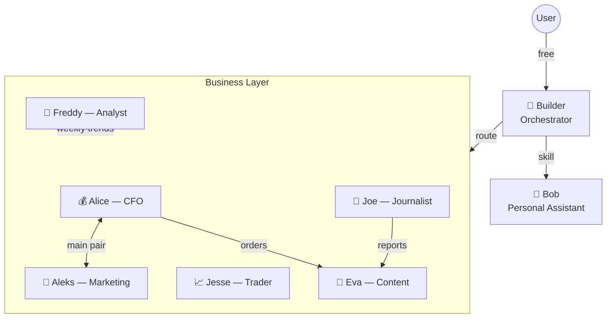

# SYNAPTICUM
## AI Corporation Architecture

---

### What is Synapticum?

Multi-agent AI system for **trading**, **content creation**, **monetization**, and **research**.

- 8 specialized agents + 1 orchestrator
- Single-layer memory: Obsidian Vault (SQLite lessons removed)
- Self-learning: corrections + Dreaming (periodic self-review)
- Multi-provider ready: Claude / DeepSeek / Qwen / OpenAI

---

### Agent Network



---

### Economy Model

| Layer | Function | Cost |
|-------|----------|------|
| **Builder** | Filter 80% requests | $0 (subscription) |
| **Prompt Optimizer** | EN + compact = −30% tokens | $0 |
| **Smart Routing** | Right agent for right task | Saves $$$  |
| **Finn Mode** | ADHD-friendly step decomposition | $0 |

**Result:** Only 20% of requests reach paid agents.

---

### Knowledge Architecture

```
Obsidian Vault (/Users/synapticum/Synapticum/Vault/)          SQLite (Per-Agent)
┌─────────────────────┐          ┌──────────────────┐
│ wiki/    — skills    │          │ conversations    │
│ rules/   — prompts   │          │ domain tables    │
│ lessons/ — learned   │          │ A2A messages     │
│ reports/ — outputs   │          └──────────────────┘
│ processes/ — tasks   │               Runtime only
└─────────────────────┘
     Single source of truth
     Provider-independent
     + Dreaming (self-review)
```

---

### Trading Infrastructure

| Component | Status |
|-----------|--------|
| Bybit V5 API (live trades) | 🟢 Active |
| Notion Trade Journal (sync) | 🟢 Active |
| TradingView (screenshots) | 🟡 → OpenClaw |
| Polymarket (prediction markets) | 🟡 Setup |
| Commercial trading bot | 🟡 Planned |

**Commercial bot pipeline:**
Qwen 3.6 27B (screenshots, $0) → DeepSeek V4 Pro (reasoning, cheap) → Jesse (supervisor) → User

---

### Content Pipeline

```
Freddy (Trends) → Joe (Articles) → Eva (Posts) → Telegram
                                      ↓
                              NanoBanana / Flux (visuals)
```

**Warmup Funnel:**
1. 🔥 Hype content (100% external) → subscribers
2. 🎯 Project teasers (Jesse interviews, results) → trust
3. 💰 Monetization (paid bots, referrals, community) → revenue

---

### Multi-Provider Strategy

| Tier | Agents | Platform | Model |
|------|--------|----------|-------|
| Heavy | Jesse, Freddy, Alice | ClaudeClaw | Opus |
| Light | Eva, Joe, Aleks | OpenClaw + OpenRouter | DeepSeek/Qwen |
| Free | Builder, Bob | Claude Code | Subscription |
| Local | OpenClaw hands | Mac Studio | Qwen 3.6 27B |

**Fallback:** One button in Launcher → switch ALL agents to backup provider.

---

### Hardware Roadmap

**Current:** Windows 11 Laptop → Claude Code + ClaudeClaw

**Target:**
- Mac Studio M3 Ultra 96GB (agents + local Qwen)
- TerraMaster D5 Hybrid (NVMe stripe 8TB + HDD backup)
- Samsung 990 PRO 4TB ×3 ($1,035)
- Flint 2 Router (Xray TPROXY, 224 servers)
- Vultr Santiago VPS ($6/mес, exit node)

---

### Revenue Streams (Planned)

| Product | Model | Target |
|---------|-------|--------|
| Trading bot | $30/user/мес | 200 users = $6K/мес |
| Bybit referrals | Commission | Passive |
| Telegram channels | Ads + sponsors | 10K+ audience |
| Paid AI assistants | Subscription | Custom bots |
| Copy-trading | Performance fee | Jesse results |
| Closed community | Premium membership | Alpha access |

---

### Status Dashboard

| System | Status |
|--------|--------|
| Builder (Orchestrator) | 🟢 Active |
| Bob (Personal) | 🟢 Active |
| Jesse (Trading) | 🟢 Partial (Bybit live) |
| Alice, Eva, Freddy, Joe, Aleks | 🟡 Scaffolding |
| Finn | 🔴 → Builder Finn mode |
| Obsidian Vault | 🟡 Structure ready, plugins pending |
| Multi-provider | 🟡 Architecture defined |
| Mac Studio | 🟡 Hardware not purchased |
| Commercial bot | 🟡 Pipeline designed |

---

*Synapticum — 2026. Updated: 2026-05-26*
