# Synapticum - Architecture Map

> Обновляется по запросу: "обнови архитектуру". Цвета: 🟢 реализовано, 🟡 в процессе/planned, 🔴 deprecated.

---

## Full Architecture Diagram

```mermaid
%%{init: {'theme': 'base', 'themeVariables': {'fontSize': '11px', 'nodeSpacing': 30, 'rankSpacing': 40}}}%%
graph TD
    USER((User)) --> BUILDER["Builder · Orchestrator<br/>Claude Code · строит и чинит"]
    BUILDER -->|A2A| BOB["Bob · Personal :41003<br/>Media · Vision · MCP-мост"]

    BUILDER -->|A2A| ALICE["Alice · CFO 🟢<br/>Monetization · Coaching"]
    BUILDER -->|A2A| JESSE["Jesse · Trader 🟢<br/>VSA/Elliott · Bybit · TTM"]
    BUILDER -->|A2A| EVA["Eva · Content 🟢<br/>SMM · Flux · IG/TG publish"]
    BUILDER -->|A2A| FREDDY["Freddy · Analyst 🟢<br/>Deep research · OR Fusion"]

    ALICE <-->|"main pair"| ALEKS["Aleks · Marketing 🟢<br/>Execution · Slides · Ads"]
    ALICE -->|"Процесс 1"| FREDDY
    FREDDY -->|brief| JOE["Joe · Journalist 🟢<br/>AI/Singularity · X-комменты"]
    JOE -->|"статья"| ALICE
    ALICE -->|"ДОСКА"| EVA
    EVA -->|"4 поста → апрув"| USER

    JESSE --- BYBIT["🟢 Bybit V5"] & TV["🟢 TradingView (TTM pair)"]
    EVA --- FLUX["🟢 Flux (fal.ai)"] & IG["🟢 Instagram Graph API"]
    JOE --- XEXT["🟢 X-comment ext<br/>bridge :41105 → Chrome MV3"]

    BUILDER & BOB & ALICE & EVA & JESSE & FREDDY & JOE & ALEKS -->|"знания"| VAULT["Obsidian Vault = весь проект<br/>wiki · rules · lessons · architecture"]
    BUILDER & BOB & ALICE & EVA & JESSE & FREDDY & JOE & ALEKS -->|"runtime"| SQLITE["SQLite + FTS5<br/>per-agent DB · archivarius.db"]

    subgraph ENGINE["Topology B: движок = слот"]
      SDK["Claude Agent SDK<br/>(подписка)"]
      OPENCLAW["OpenClaw → OpenRouter<br/>5 режимов · Fusion"]
      LOCAL["Ollama · qwen3.6:27b<br/>Finn hands (free)"]
    end
    ENGINE -.->|"generate() + getEngine()"| ALICE & EVA & JOE & ALEKS & FREDDY & JESSE & BOB

    FINN["Finn · Local Operator 🟢<br/>shell+screen+GUI (13 hands)"] --- LOCAL

    JESSE -.-> TASSIST["🟡 Trading Assistant платный"]
    EVA -.-> CHAN["🟢 TG каналы: Synapticum · FdM"]
    ALICE -.-> DELTA["🟡 Delta: агент-контур как продукт"]
    CHAN -.-> BOXBOT["🟢 BoxBot воронка @Synapticum_bot"]

    FLINT["🟢 Flint 2 · Xray TPROXY"] --- VULTR["🟢 Vultr VPS (exit)"]

    classDef green fill:#4caf50,color:#fff
    classDef yellow fill:#ffc107,color:#000
    classDef blue fill:#2196f3,color:#fff
    class BUILDER,BOB,ALICE,EVA,JESSE,FREDDY,JOE,ALEKS,FINN,BYBIT,TV,FLUX,IG,XEXT,CHAN,BOXBOT,FLINT,VULTR green
    class TASSIST,DELTA yellow
    class VAULT,SQLITE,SDK,OPENCLAW,LOCAL blue
```



---

## 1. Agent Network - Status & Details

| Agent | Location | Движок | Status | Функция |
|-------|----------|--------|--------|---------|
| **Builder** | Claude Code (Mac Studio) | Подписка | 🟢 Active | Оркестратор и строитель: код, инфраструктура, деплой, ревью |
| **Bob** | /Synapticum/ClaudeClaw | Подписка + OR vision | 🟢 Active | Личный ассистент (НЕ бизнес): медиа, поиск, заметки; MCP-мост be-bob.py; agency directive |
| **Alice** | /Synapticum/Alice | Подписка / OR | 🟢 Active | CFO + монетизация, проактивна, коучит агентов, ведёт Процесс 1 |
| **Eva** | /Synapticum/Eva | Подписка / OR | 🟢 Active | Контент и SMM: очередь постов, Flux-визуал, публикация TG + Instagram, per-channel cadence |
| **Jesse** | /Synapticum/Jesse (private) | Подписка | 🟢 Active | Трейдер: VSA/Elliott/SMC, Bybit V5 live, TTM-индикатор уровней (closed-source), learner level 100 |
| **Freddy** | /Synapticum/Analyst | OR-режимы + Fusion | 🟢 Active | Deep research: multi-iteration, «прожарка», YouTube/deep, брифы для конвейера |
| **Joe** | /Synapticum/Joe | Подписка / OR | 🟢 Active | Журналист AI/сингулярность: статьи, X-комменты (авто), Moltbook |
| **Aleks** | /Synapticum/Aleks | Sonnet / OR | 🟢 Active | Маркетинг-исполнение: репорт Алисе, живой бот, слайд-мейкер; никогда не авто-старт |
| **Finn** | /Synapticum/Finn + OpenClaw | Ollama qwen3.6:27b ($0) | 🟢 Active | Полный оператор ПК: shell + screen + GUI (13 hands__* MCP-тулов); Junior сам, Middle/Senior с подтверждением |

---

## 2. Engine Architecture - Topology B (стандарт)

**Принцип:** обёртка агента = «дом» (личность, память, Telegram, A2A), движок = сменный слот.

- Один чокпоинт: `generate()` + `getEngine()` в Shared/agent-engine - тоггл рулит схемой целиком
- Слоты: **Claude Agent SDK** (подписка, дефолт) ↔ **OpenClaw → OpenRouter** ↔ **Ollama local**
- Память и Vault общие - смена движка не трогает личность и знания
- Vision - по тогглу, per-mode billing (runVisionHTTP)

**OR-каталог (5 режимов, канон §2.1):** соло DeepSeek / Kimi / Gemini + **Fusion** (~$0.06/вызов) + **FusionMax** (~$0.22/вызов). Fusion = плагин поверх соло-режимов.

**Ключевое правило:** агенты работают на ПОДПИСКЕ + OpenRouter. ANTHROPIC_API_KEY пуст намеренно.

---

## 3. A2A Communication - 🟢 МИГРАЦИЯ ЗАВЕРШЕНА

**Протокол:** Google A2A (HTTP JSON-RPC 2.0), shared module `Shared/a2a-server/`
**Порты:** Eva:41001, Alice:41002, Bob:41003, Jesse:41004, Joe:41005, Freddy:41006, Aleks:41007
**Статус:** шина agent_messages ВЫПИЛЕНА 8/8 - связь агентов ТОЛЬКО через A2A. Архивариус = кеш/хранилка, builder_tasks = единственное исключение.

| Процесс | Участники | Статус |
|---------|-----------|--------|
| Процесс 1 (контент) | Alice → Freddy → Joe → Alice → Eva | 🟢 живой |
| Маркетинг | Alice ↔ Aleks | 🟢 |
| Research on demand | Any → Freddy → отчёт в Vault | 🟢 |
| Трейдинг | Jesse ↔ User | 🟢 |
| Делегация Builder | Archivarius builder_tasks | 🟢 |

**Rules:** Bob - НЕ в бизнес-A2A; все агенты отвечают юзеру напрямую в Telegram; Freddy с агентами write-only.

---

## 4. Knowledge Architecture

### Obsidian Vault = ВЕСЬ ПРОЕКТ (миграция завершена)

Vault - единственный источник истины: wiki, rules, lessons, reports, processes, architecture, build-спеки. SQLite - только runtime-кеш.

```
Vault/
├── wiki/            знания по доменам (trading, content, journalism, research, business, marketing, tech)
├── rules/           always-load per agent
├── lessons/         self-learning: per-agent уроки (вечные, никогда не truncate)
├── reports/         freddy/trends, joe/articles, alice/strategy
├── processes/       открытые задачи + чекпоинты
├── architecture/    build-спеки, CHECKPOINT-и, how-to-build-an-agent.md
├── drafts/          черновики Евы
├── _config/         env + budget per agent (НЕ в git)
└── architecture.md  ← THIS FILE
```

### SQLite (runtime)

| DB | Назначение |
|----|-----------|
| per-agent .db (store/) | conversations (FTS5), lessons cache, очереди |
| archivarius.db | builder_tasks, knowledge, logs |
| ~/telegram-memory/ | межсессионная память переписки |

### Self-learning
Таблица lessons в каждом агенте, инжектится в каждый промпт. Паттерны юзера (напр. «Половина») портированы 8/8.

---

## 5. Content Pipeline - Процесс 1 (живой, демо)

**Цепочка:** Alice (старт по proc1.on) → Freddy (тренд-бриф) → Joe (статья) → Alice (ДОСКА - ревью) → Eva (4 поста, топик 203) → апрув юзера → публикация.

- Каналы: **Synapticum** (ежедневно), **Fin del Mundo** (раз в 3 дня), Instagram-repost через Graph API
- Eva: очередь eva-queue.mjs, publisher само-лечит сбои, brief auto-archive (1 активный бриф на трек)
- Joe: X-комменты автоматом (CDP keystrokes, likes≥10 AND replies≥10), окно mlphoto
- BoxBot 🟢: воронка канала @Synapticum_bot, открыт провайдер оплаты
- IG-запуск (личный зонтик): Travel 80 / Studio 20, Reels-мотор - 🟡 в работе

---

## 6. Trading Infrastructure

| Component | Status | Details |
|-----------|--------|---------|
| Bybit V5 API | 🟢 Live | Balance, positions, PNL, stop-loss |
| TTM-индикатор уровней | 🟢 Тест у трейдера | Pine, пара senior+junior (closed-source, private repo) |
| PineTS-стенд (pair_sim) | 🟢 | Рендер+дифф каждой правки ДО отправки |
| Сигнальщик | 🟢 Пилот | ttm_signals: читает сеньора+джуниора |
| Notion Trade Journal | 🟢 Live | Bidirectional sync |
| Trading Assistant платный | 🟡 Planned | Qwen скрины → DeepSeek reasoning → Jesse supervisor |

---

## 7. External Integrations

| Service | Agent | Status |
|---------|-------|--------|
| Notion (4 БД: Agents/Instructions/Lessons/Knowledge) | All | 🟢 |
| Bybit V5 | Jesse | 🟢 |
| GitHub (maksly4arg-art) | All | 🟢 public: 9 репо + Synapticum (архитектура); private: Jesse, Vault |
| Instagram Graph API | Eva | 🟢 (токен refresh 60 дней) |
| Flux (fal.ai) | Eva | 🟢 |
| Groq Whisper | All | 🟢 голосовые → текст |
| OpenRouter | Freddy, Eva, Joe, Aleks, Bob | 🟢 5 режимов |
| Ollama (qwen3.6:27b) | Finn | 🟢 local, $0 |
| X (Chrome MV3 extension + bridge :41105) | Joe | 🟢 |
| n8n | автоматизации | 🟡 |

---

## 8. Hardware & Network

### Mac Studio (прод, миграция с Windows ЗАВЕРШЕНА)
- Канон: `~/Synapticum/`, Vault открывать из `~/Synapticum/Vault`
- Launcher: ClaudeClaw/launcher.pyw (tkinter) - ЕДИНСТВЕННЫЙ способ управлять процессами агентов
- Тяжёлая локальная LLM: iogpu.wired_limit_mb → 90ГБ (free-ram-for-llm.sh)
- Storage: Samsung 990 PRO 4TB (ORICO USB4); проект на внутреннем SSD

### Network 🟢
- Flint 2 Router: Xray TPROXY, default Аргентина, watchdog */3
- Vultr Santiago VPS: exit-нода VLESS+Reality (адрес в приватных доках; НЕ destroy)
- Builder curl идёт через локальный прокси (Clash 7897), боты - напрямую

---

## 9. Revenue Streams

| Product | Owner | Model | Status |
|---------|-------|-------|--------|
| **Delta - агент-контур как продукт** | Builder + Alice | SaaS: 1 клиент = свой VPS+Vault+бот; 2 тарифа (BYO-подписка / метереный OR) | 🟡 ждём VPS |
| BoxBot воронка канала | Eva + Alice | Подписка/оплата в TG | 🟢 живой |
| TG каналы (Synapticum, FdM) | Eva + Joe | Аудитория → воронка | 🟢 Phase 1 |
| Trading Assistant | Jesse | $/user/мес | 🟡 Planned |
| TTM-индикатор | Jesse + трейдер | Продукт для трейдеров | 🟡 Тест |
| Bybit referrals | Alice | Commission | 🟡 |

Модель юзера: 1000×$1000.

---

## 10. Backup & Recovery

| Component | Status | Details |
|-----------|--------|---------|
| Bat Бекапа (synapticum_backup.ps1 → mac) | 🟢 | ZIP → Synapticum/Backups/, вс 03:00 |
| GitHub repos | 🟢 | 9 public (snapshot 2026-07-29) + Jesse/Vault private |
| Память Builder | 🟢 | ~/.claude auto-memory + SQLite + Notion + логи сессий |

---

*Last updated: 2026-07-29 by Builder. To update: "обнови архитектуру"*
